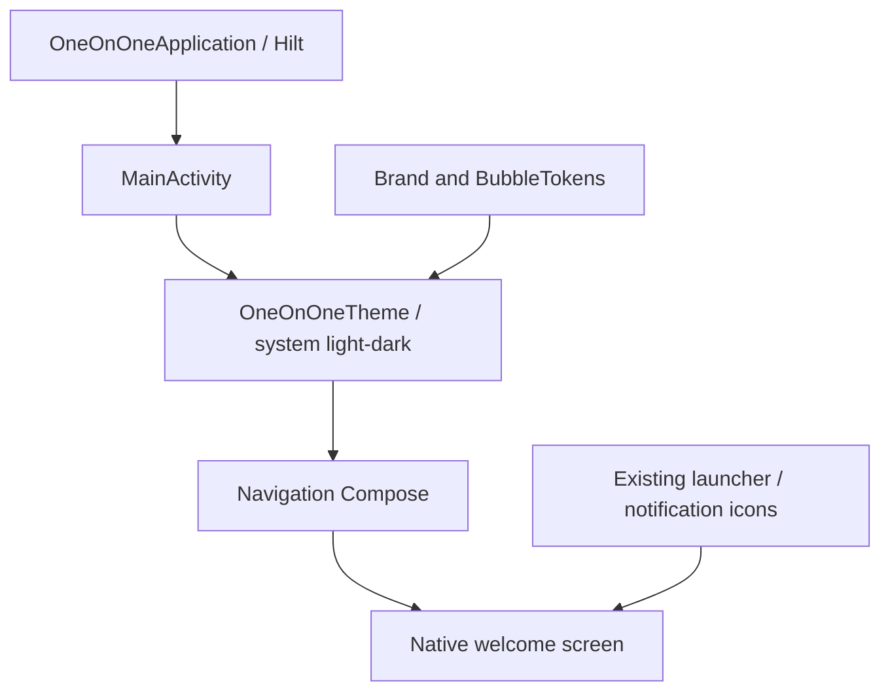
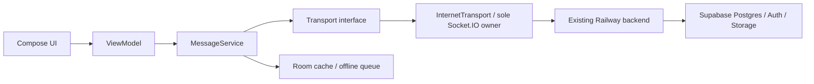
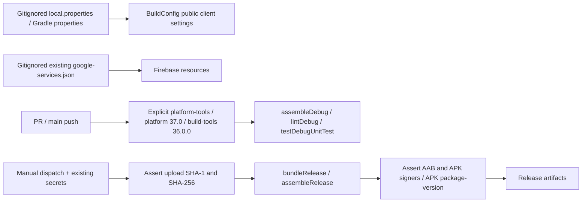
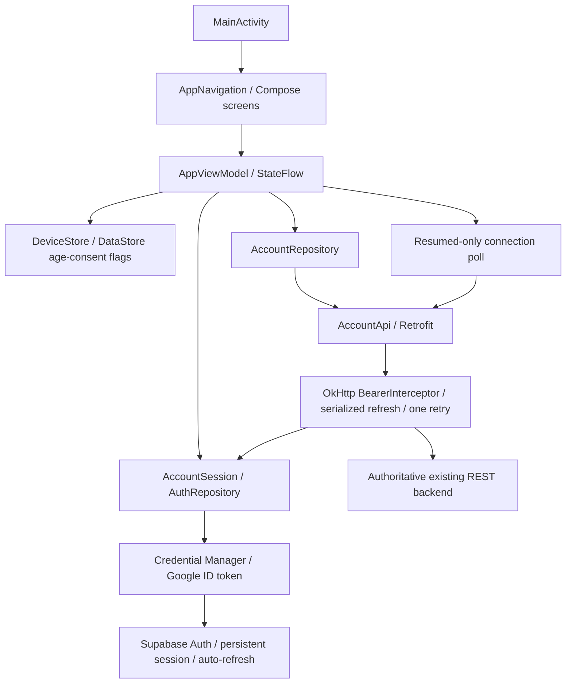
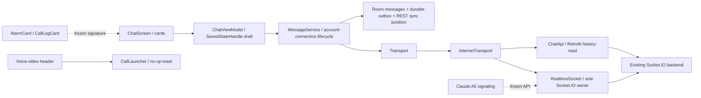
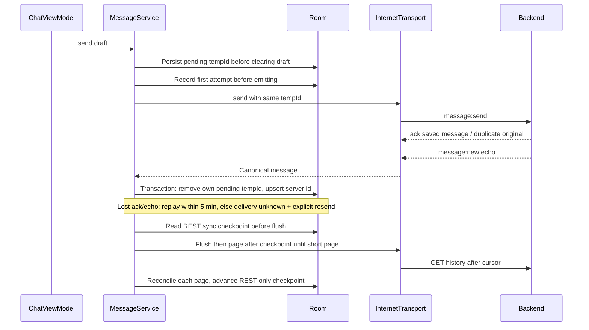
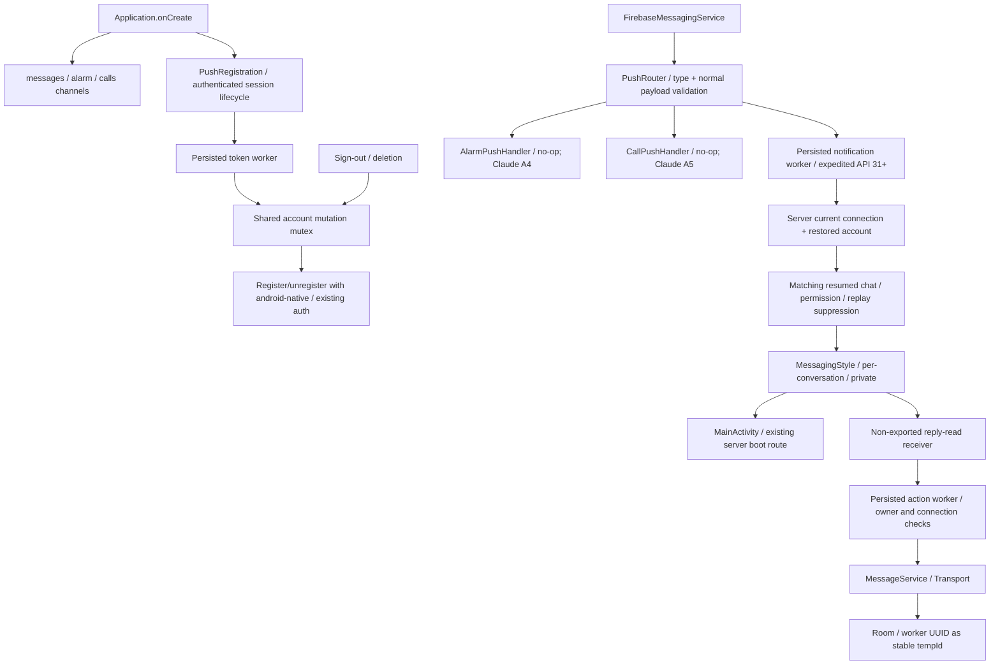
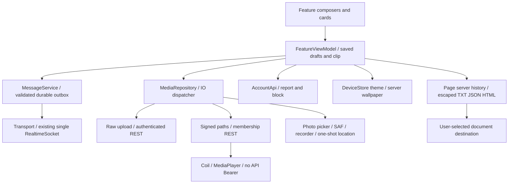
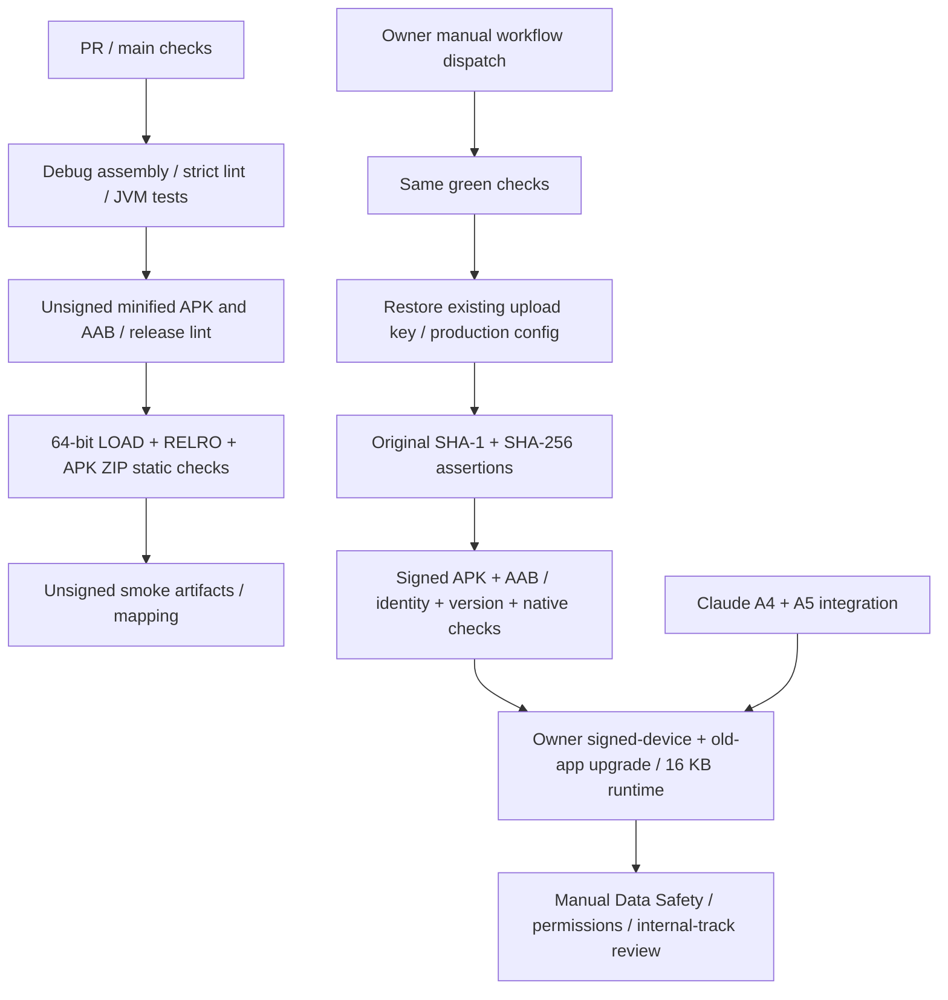
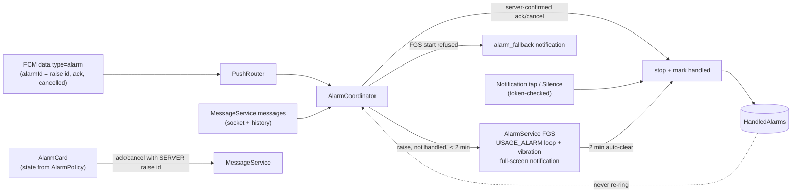

# Native Android architecture

## A0 — implemented scaffold

Single app module, single exported Activity, Kotlin + Compose + Material 3,
Navigation Compose and Hilt. The only route is `welcome`; no auth, message,
push-token or call work is started. Incoming Activity extras are not consumed.
Firebase Messaging auto-init is disabled until A3. Backup is disabled because
later milestones store account/session/message state locally.

`ui/theme/BubbleTokens.kt` mirrors the entire web architecture token table dated
2026-10-07: dark, light, love and samurai; mine/other gradient stops, tails, text,
metadata, edges, sent ticks and read ticks. Wallpaper palettes apply in both
themes. Background gradients use 135 degrees when chat arrives in A2/A6.
The dark brand is green `#7ee787`, blue `#79c0ff`, background `#0d1117`;
system light mode uses readable green/blue accents without dynamic color.

## Required message boundary — planned for A2, not implemented in A0

Every send, receive, reaction and call signal must stay behind the transport
boundary. REST repositories use Retrofit/OkHttp; Supabase Auth tokens authorize
REST and socket handshakes. The server validates identity, membership, status and
message payloads. Room is a cache, never an authorization source. A0 has no fake
repository, fake transport or backend implementation. No Bluetooth transport is
in scope.

## Build configuration and identity

`app.web.oneonone`, minSdk 26, target/compile 37, versionCode 5 by default.
Signing is the unchanged upload identity; no key-generation path exists. Secret
files are scrubbed in CI. The API snapshot in this repo is copied verbatim from
the web repo; future changes must use the authoritative web contract, not infer
behavior from client code. No backend deployment or schema change is part of A0.

### A0 CI setup correction

Both debug and release jobs explicitly install platform-tools, platform 37.0
and build-tools 36.0.0. setup-android v3's default also asks for the removed
legacy `tools` package, so using its default fails before Gradle starts. The
explicit package list keeps the checks and release job on the same SDK/toolset.

## A1 — auth, gates and account state

Navigation owns home, settings and blocked accounts. Home reflects a single
server-derived boot route; the age/consent gate comes before account screens.
On sign-out, protected back-stack screens are discarded. Date of birth is used
only in the UI; DataStore saves age verification and acceptance time, matching
the web's per-device rules. Connection state is not persisted as authorization.

Small AccountSession/DeviceStore interfaces allow JVM ViewModel/repository tests
without a Credential Manager/Android storage runtime. Supabase SDK session storage
and auto-refresh are reused; there is no custom token store. The interceptor runs
on OkHttp workers, never the main thread, and serializes only rejected-token
refreshes. An old request cannot invalidate a newer signed-in session. Push token
storage/unregister is wired now; actual registration and lifecycle arrive in A3.

This milestone consumes only the contract's me/current/request/accept/decline/
cancel/blocks/unregister/deletion routes. A2 will replace the chat placeholder and
introduce the frozen RealtimeSocket and rendering/call-launch seams, superseding
the old A0 diagram's sole-socket-owner label with RealtimeSocket.

## A2 — chat, durable queue and frozen realtime seam

The A0 diagram's socket ownership label is superseded: only RealtimeSocket creates
Socket.IO, InternetTransport consumes it, and every message path remains behind
MessageService/Transport. A singleton application IO scope owns the active
conversation; per-conversation supervised collectors are cancelled and joined on
change/sign-out. The socket stays connected in background until teardown; the UI's
resumed-chat flag controls mark-read (A3 will also use it for notification suppression).
Call consumers share the same singleton rather than creating another socket.

Room v1 has composite owner/connection/message keys and a separately persisted
REST watermark. Incoming/ack timestamps never advance it; otherwise an ack during
reconnect could skip missing older messages. Server timestamps are normalized to
fixed-width UTC only for SQLite sort columns; message bodies preserve wire values.
History replaces reactions authoritatively; a delayed tempId ack preserves newer
cached reaction changes. Room/cache/receipt flags do not grant membership.

Frozen public APIs and exact placeholder file ownership are listed in PROGRESS.
Claude may replace the CallLauncher binding and both cards, and add A4/A5 lifecycle
consumers without changing the message pipeline or opening another socket.

## A3 — data-only push and background work

FCM callbacks do no slow network work; WorkManager keeps token/notification/action
work alive across process loss. API 31+ notification jobs are expedited; older APIs
use normal work without introducing an A3 foreground service. Server membership is
checked before posting/action execution. A delayed push cannot target a different
current conversation, and notification actions name a captured auth subject as well
as the conversation. MainActivity consumes no untrusted push authorization extras.

Reply work uses its immutable WorkRequest UUID as tempId. Enqueue first checks the
scoped Room alias; REST history preserves that alias on a canonical row, so worker
retries recognize already-acknowledged sends. The A2 five-minute uncertainty policy
still applies. Registration stores a candidate before HTTP and shares a mutex with
sign-out; in-flight registration finishes before token cleanup/session removal.

The three handler methods and exact PushHandlersModule path are frozen for Claude.
Message notifications never invoke an alarm or call implementation. The existing
notification-block missed-call fallback remains a generic no-action notice.
Proprietary OEM activities are unverified best-effort entry points with native
Settings/App info fallback; optional permission settings never gate account/chat use.

## A6 — structured features, private media and export

Structured features reuse ordinary immutable messages and replyTo rather than a
second state protocol. Contract validators run before Room enqueue. Ask/pick reply
attribution follows the original author. Alarm and call rendering/entry/push seams
remain frozen for Claude. No second socket or transport is constructed.

Media ownership is the current app user and connection; uploads and location
re-check that scope after asynchronous work. Completed voice clips survive config
changes/process restoration in private cache, while live recording and playback
stop at background/navigation. FileProvider exposes only `cache/shared`, never the
cache root or arbitrary paths. Unauthenticated media/map clients do not carry REST
credentials. Signed paths are server-authorized; storage URLs require HTTPS and the
configured Supabase host. Static photos strip EXIF by pixel re-encoding with a 4 MP
memory ceiling. Voice uses media audio focus and leaves call routing/mode alone.

Coil's official GIF/cache-control extensions share the pinned Coil version. The
custom client identifies the app for OSM and honors HTTP caching. Map tiles are
requested only when their cards are composed; no offline maps or tile prefetch.
Themes are per-device, wallpapers shared, and legacy line style renders bubbles
as the reference currently does. Export pages existing REST history and escapes
all HTML content; it includes attachment metadata rather than permanent media URLs.

## A7 — shrinker and release gates

R8 keeps dynamic protocol/engine and WebRTC JNI boundaries with consumer rules
for Android/framework DI/serialization/database/background work. Two exact Ktor
JMX warnings are excluded because the pinned detector catches their absence on
Android; all other unresolved dependencies fail the build. Mapping is retained.
Resource shrinking and dependency ART profiles are enabled without claiming a
measured app baseline profile or authenticated runtime verification.

The native checker examines actual ELF64 headers for arm64-v8a/x86_64 in APK/AAB
and verifies stored APK entry offsets. RELRO is checked against writable segment
ranges rather than rejecting safe whole-LOAD endpoints solely for a nonzero
modulo. This static evidence doesn't replace a final 16 KB runtime test. See the
[Android linker source](https://android.googlesource.com/platform/bionic/+/main/linker/linker_phdr.cpp)
and [page-size guidance](https://developer.android.com/guide/practices/page-sizes).

Unsigned smoke artifacts and any local debug-signed minified copy are separate
from manual CI's real upload-key artifacts. Signed CI still verifies the original
certificate and Firebase/package/version assertions; it never uploads to Play.
Final release requires Claude's reserved features plus owner phone/Console gates.
The release checklist is a Data Safety draft grounded in current native behavior
and the web privacy/API references, with final SDK/provider/call review explicit.

## Emergency alarm (A4)

