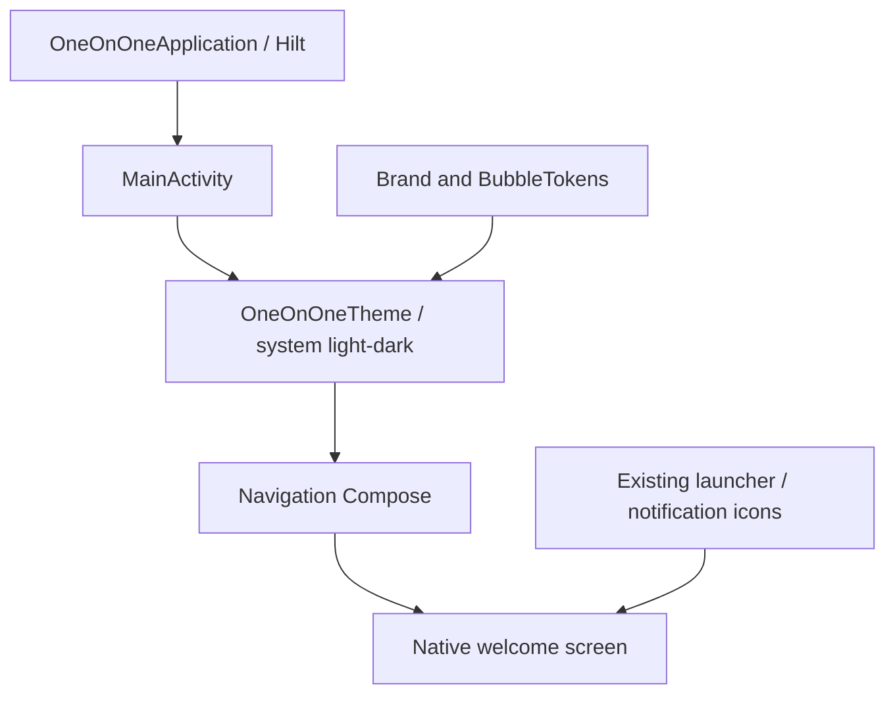
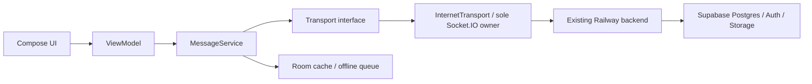
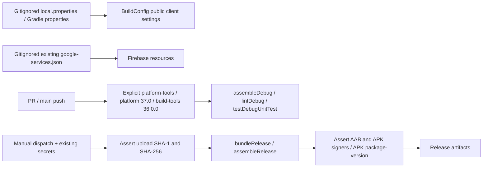
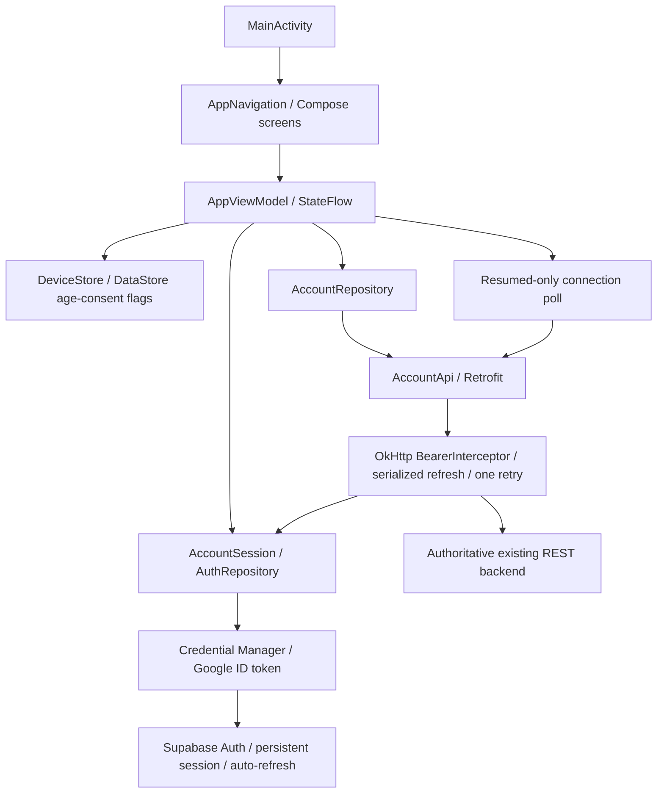

# Native Android architecture

## A0 — implemented scaffold

Single app module, single exported Activity, Kotlin + Compose + Material 3,
Navigation Compose and Hilt. The only route is `welcome`; no auth, message,
push-token or call work is started. Incoming Activity extras are not consumed.
Firebase Messaging auto-init is disabled until A3. Backup is disabled because
later milestones store account/session/message state locally.

`ui/theme/BubbleTokens.kt` mirrors the entire web architecture token table dated
2026-10-07: dark, light, love and samurai; mine/other gradient stops, tails, text,
metadata, edges, sent ticks and read ticks. Wallpaper palettes apply in both
themes. Background gradients use 135 degrees when chat arrives in A2/A6.
The dark brand is green `#7ee787`, blue `#79c0ff`, background `#0d1117`;
system light mode uses readable green/blue accents without dynamic color.

## Required message boundary — planned for A2, not implemented in A0

Every send, receive, reaction and call signal must stay behind the transport
boundary. REST repositories use Retrofit/OkHttp; Supabase Auth tokens authorize
REST and socket handshakes. The server validates identity, membership, status and
message payloads. Room is a cache, never an authorization source. A0 has no fake
repository, fake transport or backend implementation. No Bluetooth transport is
in scope.

## Build configuration and identity

`app.web.oneonone`, minSdk 26, target/compile 37, versionCode 5 by default.
Signing is the unchanged upload identity; no key-generation path exists. Secret
files are scrubbed in CI. The API snapshot in this repo is copied verbatim from
the web repo; future changes must use the authoritative web contract, not infer
behavior from client code. No backend deployment or schema change is part of A0.

### A0 CI setup correction

Both debug and release jobs explicitly install platform-tools, platform 37.0
and build-tools 36.0.0. setup-android v3's default also asks for the removed
legacy `tools` package, so using its default fails before Gradle starts. The
explicit package list keeps the checks and release job on the same SDK/toolset.

## A1 — auth, gates and account state

Navigation owns home, settings and blocked accounts. Home reflects a single
server-derived boot route; the age/consent gate comes before account screens.
On sign-out, protected back-stack screens are discarded. Date of birth is used
only in the UI; DataStore saves age verification and acceptance time, matching
the web's per-device rules. Connection state is not persisted as authorization.

Small AccountSession/DeviceStore interfaces allow JVM ViewModel/repository tests
without a Credential Manager/Android storage runtime. Supabase SDK session storage
and auto-refresh are reused; there is no custom token store. The interceptor runs
on OkHttp workers, never the main thread, and serializes only rejected-token
refreshes. An old request cannot invalidate a newer signed-in session. Push token
storage/unregister is wired now; actual registration and lifecycle arrive in A3.

This milestone consumes only the contract's me/current/request/accept/decline/
cancel/blocks/unregister/deletion routes. A2 will replace the chat placeholder and
introduce the frozen RealtimeSocket and rendering/call-launch seams, superseding
the old A0 diagram's sole-socket-owner label with RealtimeSocket.
